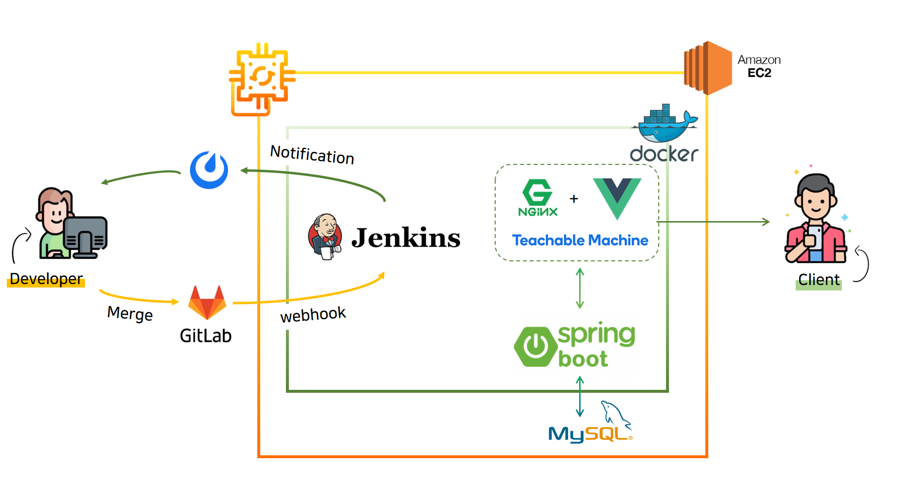

# Porting Manual

🚀 배포 플로우



#### 기술 스택

<details>
    <summary>Back-end</summary>
    <ul>
          <li>Spring-Boot : 2.5.4</li>
          <li>Spring Security</li>
          <li>spring-boot-starter-jdbc</li>
          <li>spring-boot-starter-jpa</li>
          <li>spring-boot-starter-redis</li>
          <li>spring-boot-starter-security</li>
          <li>spring-boot-starter-data-jdbc</li>
          <li>jjwt : 3.18</li>
          <li>lombok</li>
          <li>mysql</li>
          <li>junit : 4.12</li>
          <li>swagger : 2.9.2</li>
      </ul>
</details>

<details>
        <summary>Front-end</summary>
    <ul>
          <li>Js</li>
          <li>HTML</li>
          <li>CSS</li>
          <li>Vue.js</li>
      </ul>
    -------------------------------------------
    <h5>
          라이브러리
    </h5>
    <ul>
      <li>Apexchart</li>
      <li>Datepicker</li>
      <li>teachablemachin/image</li>
      <li>tensorflow/tfjs</li>
      <li>jwt-decode</li>
      <li>vuex-persistedstate</li>
  </ul>

<details>
        <summary>Infra</summary>
    <ul>
          <li>nginx</li>
          <li>docker</li>
          <li>jenkins</li>
          <li>gitlab</li>
          <li>mattermost</li>
      </ul>


#### ⚙ 시스템 구성

- `Jenkins 3.7 - blueocean` : CI/CD tool
- `Docker` : Backend/Frontend(`nginx`) 컨테이너 실행
- `nginx` : docker에서 Frontend를 실행하며, Backend를 redirecting 합니다.

#### 💻 개발 환경

- Java `1.8`
- MySQL `5.7`
- IntelliJ IDEA ULTIMATE `2020.3


#### 🕹 Install & Usage

##### Docker network 설정

```bash
$ sudo docker network create studywithuscicdnetwork
```

#####  SSL Key 발급

```
$ sudo apt-get install letsencrypt
$ sudo letsencrypt certonly --standalone -d <www제외한 도메인 이름>

ssl_certificate /etc/letsencrypt/live/도메인이름/fullchain.pem; 
ssl_certificate_key /etc/letsencrypt/live/도메인이름/privkey.pem; 
```

##### Frontend Docker image 생성 및 실행

```bash
$ docker build -t frontend:latest ./frontend/
$ docker run -d --name frontend -p 80:80 -p 443:443 \
  -v /etc/letsencrypt:/cert -v /etc/localtime:/etc/localtime:ro \
  --network studywithuscicdnetwork frontend:latest


```

##### Backend Docker imge 생성 및 실행

```bash
$ docker build -t backend:latest ./backend
$ docker run -d --name backend -p 8080:8080 \
  --network studywithuscicdnetwork backend:latest
```

##### 위의 설치 및 실행 과정에서 사용되는 설정파일들은 다음과 같습니다.

- `../frontend/Dockerfile`
- `../frontend/homepage.conf`
- `../backend/Dockerfile`
